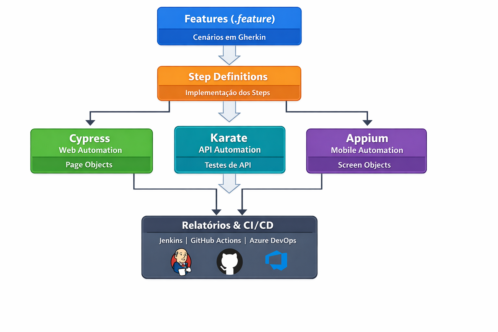

## Automação de Testes 

Esta pasta centraliza todos os projetos de automação com exemplos que eu já desenvolvi para Web, API e Mobile, priorizando organização, escalabilidade e boas práticas de design patterns.

## Fluxo Visual da Automação



Cada projeto segue o padrão BDD (Cucumber/Gherkin) sempre que aplicável e utiliza Page Object / Screen Object para organizar interações com a aplicação.

## Cypress – Web Automation (Page Object)
Propósito

Automação de testes end-to-end para aplicações web. Quando disponivel sao utiliados os elementos das páginas para facilitar a utiliaçao do POM.
Contudo, agora irei demontrar uma estrutura com `Page Object Model (POM)` para separar lógica da página dos cenários de teste, garantindo manutenibilidade e escalabilidade.

```bash
cypress/
├── e2e/
│   ├── features/
│   │   ├── login.feature
│   └── step_definitions/
│       ├── loginSteps.js
├── pages/
│   ├── LoginPage.js
├── support/
│   ├── commands.js
│   └── e2e.js
├── cypress.config.js
└── jenkins-qa.properties
```
Exemplo de Page Object
```bash
// cypress/pages/LoginPage.js
class LoginPage {
  visit() {
    cy.visit('/login')
  }

  fillUsername(username) {
    cy.get('#username').type(username)
  }

  fillPassword(password) {
    cy.get('#password').type(password)
  }

  submit() {
    cy.get('#login-button').click()
  }
}

export default new LoginPage()
```

Exemplo de Step Definition usando Page Object

```bash
import LoginPage from '../pages/LoginPage'
Given('que o usuário acessa a página de login', () => {
  LoginPage.visit()
})

When('ele informa usuário e senha válidos', () => {
  LoginPage.fillUsername('usuarioTeste')
  LoginPage.fillPassword('senha123')
  LoginPage.submit()
})

Then('o sistema deve permitir o acesso', () => {
  cy.url().should('include', '/home')
})
```

## Karate – API Automation
Propósito

Automação de testes de API para validar endpoints, payloads, autenticação e integrações.

```bash
Estrutura minima
karate/
├── features/
│   ├── loginAPI.feature
│   └── usersAPI.feature
├── jenkins-qa.properties
└── karate-config.js
```

Exemplo de cenário

```bash
Feature: API de login
Scenario: Login com sucesso
  Given url 'https://api.exemplo.com/login'
  And request { "usuario": "teste", "senha": "1234" }
  When method post
  Then status 200
  And match response.message == 'Login realizado com sucesso'
```

## Appium – Mobile Automation (Screen Object)
Propósito

Automação de testes mobile para Android e iOS, utilizando `Screen Object Model`, separando elementos da tela da lógica de teste, seguindo boas práticas de POM adaptadas para mobile.

```bash
Estrutura minima
appium/
├── features/
│   ├── mobile-login.feature
├── steps/
│   └── MobileLoginSteps.java
├── screens/
│   ├── LoginScreen.java
├── jenkins-qa.properties
└── appium-config.js
```

Exemplo de Screen Object
```bash
// appium/screens/LoginScreen.java
package screens;

import io.appium.java_client.MobileElement;
import io.appium.java_client.android.AndroidDriver;

public class LoginScreen {
    private AndroidDriver<MobileElement> driver;
    public LoginScreen(AndroidDriver<MobileElement> driver){
        this.driver = driver;
    }

    public void fillUsername(String username){
        driver.findElementById("username_field").sendKeys(username);
    }

    public void fillPassword(String password){
        driver.findElementById("password_field").sendKeys(password);
    }

    public void submit(){
        driver.findElementById("login_button").click();
    }
}
```
Exemplo de Step Definition usando Screen Object
```bash
import io.cucumber.java.en.*;
import screens.LoginScreen;

public class MobileLoginSteps {
    LoginScreen loginScreen = new LoginScreen(Hooks.getDriver());

    @Given("que o usuário está na tela de login")
    public void usuario_na_tela_login() {
        // A tela de login já foi aberta pelo Hooks
    }

    @When("ele informa usuário e senha válidos")
    public void informa_usuario_e_senha() {
        loginScreen.fillUsername("usuarioTeste");
        loginScreen.fillPassword("senha123");
        loginScreen.submit();
    }

    @Then("o sistema permite o acesso")
    public void verifica_login_sucesso() {
    }
}
```

## Relatórios e Integração Contínua

Cada projeto gera relatórios detalhados de execução (cenários aprovados, falhas, tempo de execução).
Integração com pipelines de CI/CD (Jenkins, GitHub Actions, Azure DevOps) para execução automática a cada push ou merge.


## Boas práticas aplicadas

* Page Object / Screen Object para organizar lógica de páginas e telas.
* Separação de responsabilidades: cenários (.feature) separados da implementação (steps).
* Reutilização de comandos/helpers para evitar duplicação de código.
* Padrão BDD para facilitar entendimento entre QA, devs e negócio.
* Estrutura escalável que permite inclusão de novos testes sem bagunçar o projeto.
* Relatórios e integração contínua para acompanhar qualidade em tempo real.
